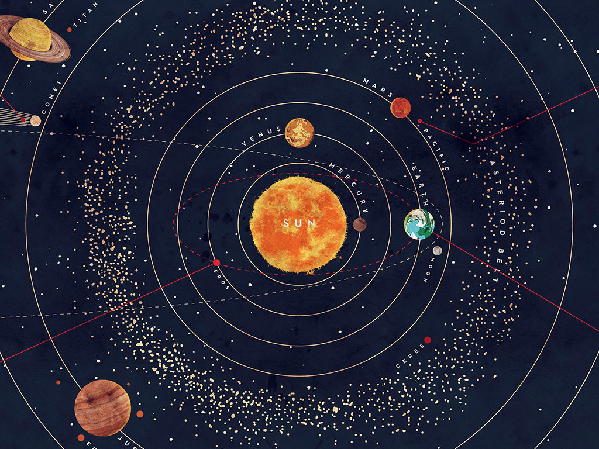
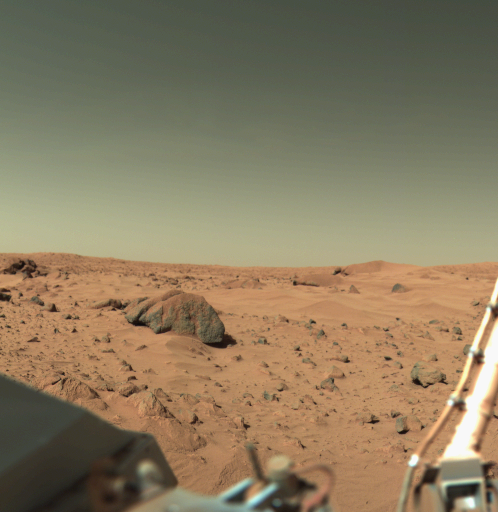
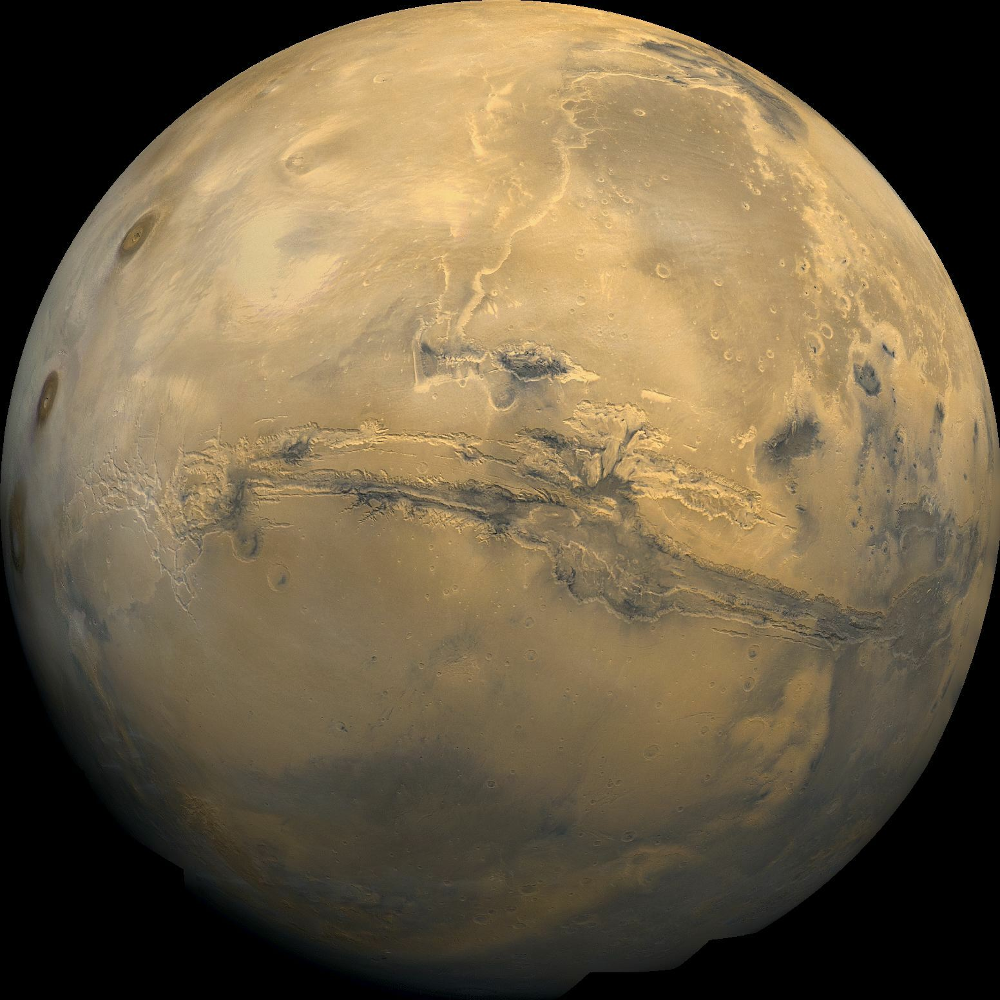
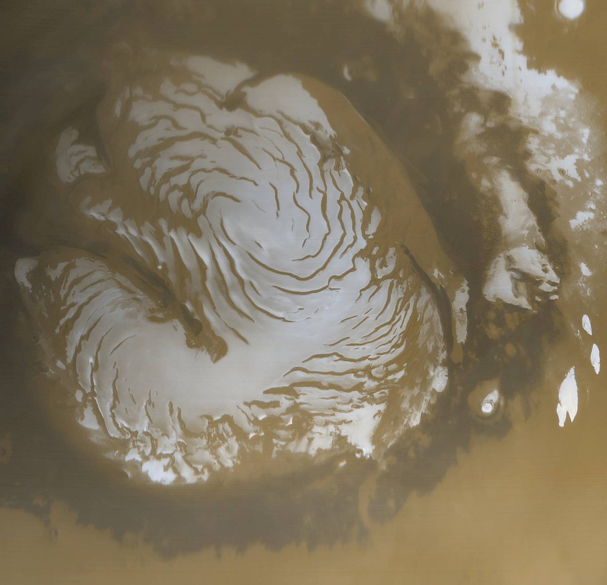
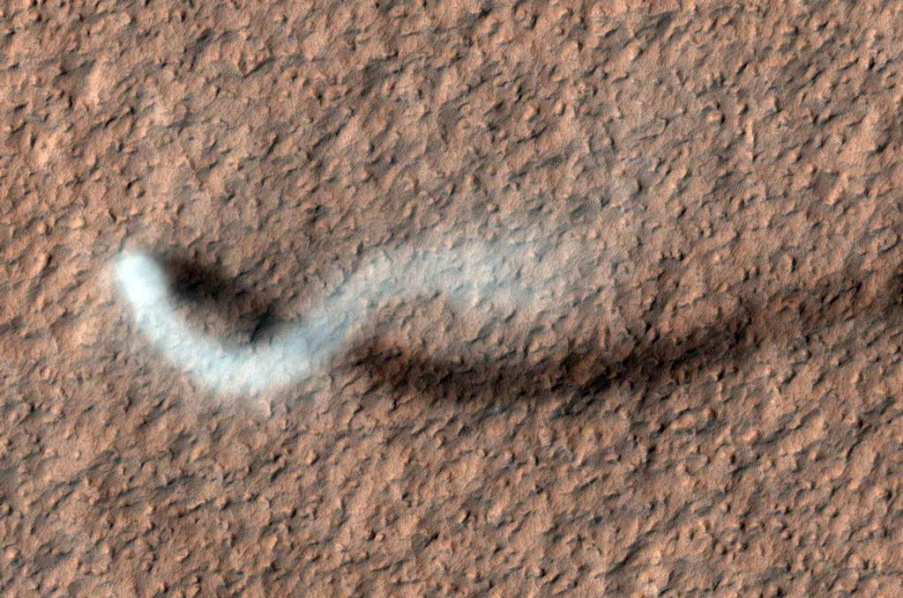
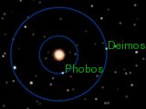
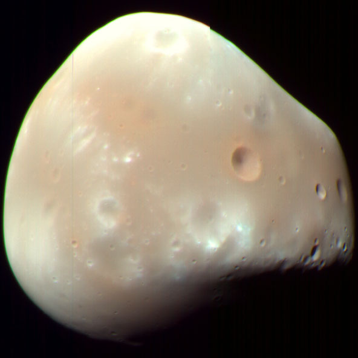

Il pianeta Marte
=====

Marte è il quarto pianeta del sistema solare in ordine di distanza dal Sole; Marte è visibile a occhio nudo ed è l'ultimo dei pianeti di tipo terrestre (cioè un pianeta composto per la maggior parte di roccia e metalli) dopo Mercurio, Venere e la Terra. 

Chiamato il Pianeta rosso a causa del suo colore caratteristico causato dalle grandi quantità di ossido di ferro che lo ricoprono, Marte prende il nome dall'omonima divinità della mitologia romana e il suo simbolo astronomico è la rappresentazione stilizzata dello scudo e della lancia del dio. 

Image credit: USGS \[Public domain\]

Pur presentando temperature medie superficiali piuttosto basse (tra i −120 °C e −14 °C) e un atmosfera molto rarefatta, è il pianeta più simile alla Terra tra quelli del sistema solare.

Questa è la superficie del pianeta vista dalla prima sonda che ci fu mandata, la [Viking 1](https://it.wikipedia.org/wiki/Programma_Viking), nel 1975.

Le dimensioni di Marte sono una via di mezzo tra quelle della Luna e della Terra, e ha una durata del giorno molto simile a quella del nostro pianeta. La sua superficie presenta segni di **formazioni vulcaniche**, **valli**, **calotte polari** e formazioni geologiche che ci fanno pensare che nel passato ci fosse acqua su Marte.

Questa è una fotografia dell'[Ascraeus Mons](https://it.wikipedia.org/wiki/Ascraeus_Mons), uno dei vulcani più alti di Marte. La fotografia è stata scattata dalla sonda [Mariner 9](https://it.wikipedia.org/wiki/Mariner_9), che fu la prima ad orbitare intorno al pianeta rosso intorno nel 1971. Il vulcano non è più attivo, ma lo è stato per tanti anni durante la storia recente del pianeta rosso.

Nella fotografia qui sopra si vedono bene i grandi vulcani della regione di *Tharsis* e il grande insieme di canyon che si spiega lungo l'equatore del pianeta. Questo insieme di canyon si chiama *Valle del Mariner*, ed è lunga più di **4000 km**. 4000 km sono un pò di più del diametro della Luna. La fotografia qui sopra è stata costruita mettendo insieme 102 fotografie fatta dalla sonda orbitale Viking 1.

Queste invece sono due fotografie delle calotte polari di Marte, quella settentrionale e quella meridionale.

La superficie del pianeta Marte è fortemente craterizzata, a causa della quasi completa assenza di agenti erosivi (come il vento e l'acqua) e di altri fattori, come l'assenza di attività tettonica delle placche. La bassissima densità dell'atmosfera di Marte non consente di consumare buona parte delle meteore che poi arrivano al suolo molto frequentemente. La superficie di Marte è molto spesso scossa da potenti tempeste di polvere e sabbia rossa, con tornadi molto potenti. Ecco l'effetto di una potente tempesta di sabbia sulla superficie del pianeta nel 2018:

Ecco un esempio di un tornado fotografato dall'orbita:

Un altra cosa molto interessate di Marte è il [*Monte Olimpo*](https://it.wikipedia.org/wiki/Olympus_Mons), che è il vulcano più alto di tutto il sistema - alto quasi 27 km!

Una cosa molto importante scoperta durante le ultime missioni sul pianeta rosso è stata quella di acqua congelata.

Marte ha due satelliti naturali che gli orbitano intorno. Il più vicino alla superficie si chiama *Fobos* mentre quello più esterno si chiama *Deimos*. Questa animazione fa vedere come sono le orbite di Deimos e Fobos:

Ecco Fobos:

Ecco Deimos:

